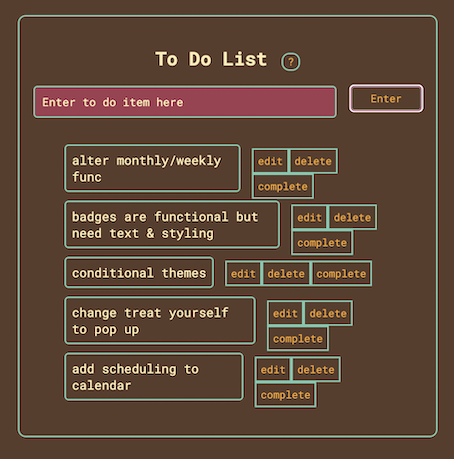

# tlc-productivity-finalproject
My Final Project for cb-wd-23 (Concordia Bootcamp)

**A Gamified To-Do List Tracker**

**Project features:** 

Google Auth0 Login
- Site designed to either retrieve information or create a new user upon Login

3 To Do Lists; An everyday, weekly and monthly list
- Each list gives a different amount of points per item completed 
- These points are tracked on the profile page and used to unlock achievement badges and site themes

Rewards/Treat Yourself
- On the main page there is an option to hit a 'Treat Yourself' button. This pulls a random value from an array of rewards that is set in the profile page. Rewards are added by the user to give them a more personalized experience. 

Mongo Database: 
- Info from Auth0 Login is used to create a Mongo user which holds all of the current daily, weekly and monthly to do tasks alongside the users custom rewards and task completed count
- This task completed count is used to calculate points and levels on the frontend

Calendar: 
- Currently a calendar built for reference w/ plans to integrate either the google calendar api or add functionality to schedule events 

Theme Toggle: 
- Colored theme modes (currently 5 themes) including a Light and Dark mode are available on the Settings page

Clock & Header: 
- Using the time and information from Auth0 to create a personalized greeting for the user. Auth0 will use the 'nickname' value received from the email (thisisthenickname@butnotthispart.com). Assuming the user doesn't want to continue using their email for their greeting there is an option in Settings to further personalize it.

**Stretch/To Do (yes, the irony):** 
Below is a shot from the to do list items stored in my personal account when I log in... which just so happen to be the remaining work left for this project. 

